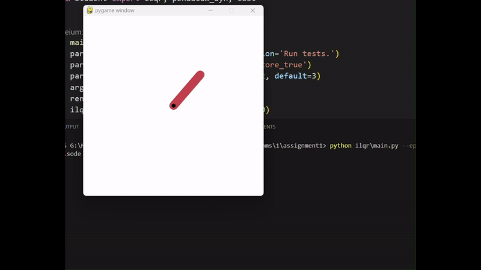

# policy_iter-frozenlake-and-ilqr-pendulum

- First, create and start the Virtual Environment, then run using the commands below. Follow the [instructions here](./virtual_env_setup.md) venv setup.
- Read the [report here](./report.pdf)
- Read the [requirement's file here](./1-assignment-word.pdf)

## ILQR

To run ILQR for the Pendulum environment, do:

```bash
python ./ilqr/main.py --episodes=5 --render
```



## Policy Iteration

To run the Policy Iteration algorithm on the Frozen lake env, do:

```bash
python ./policy_iteration/main.py --render
```